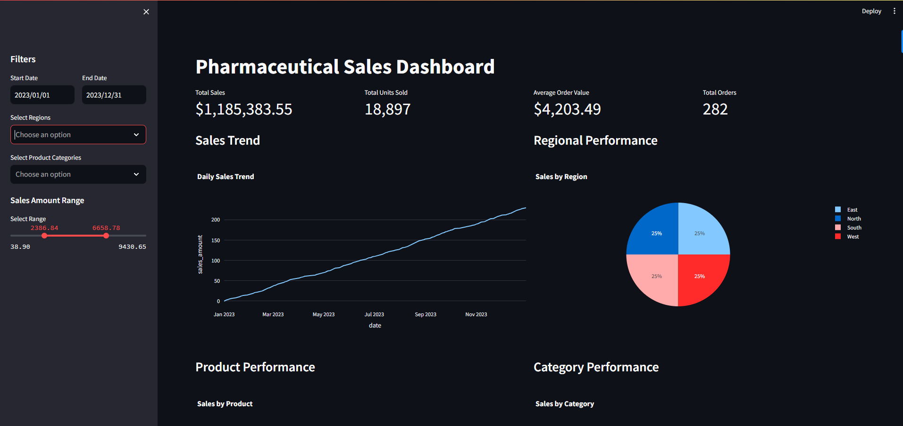
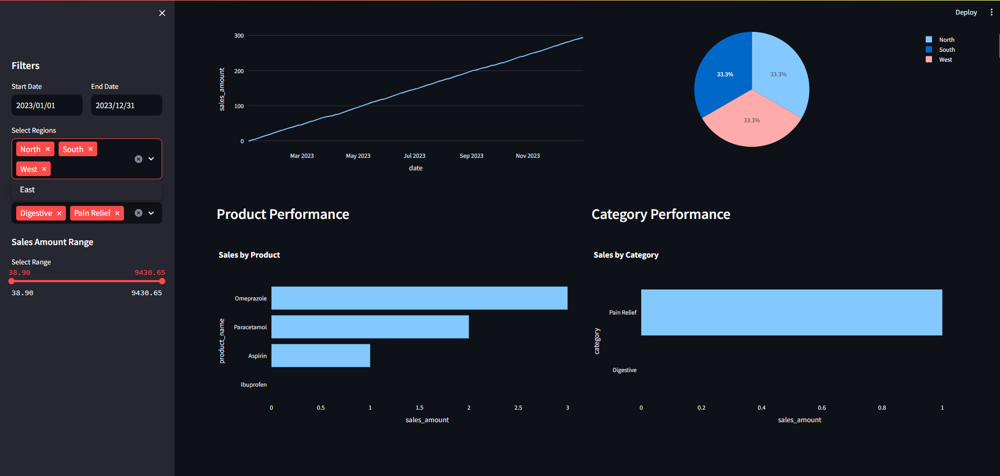
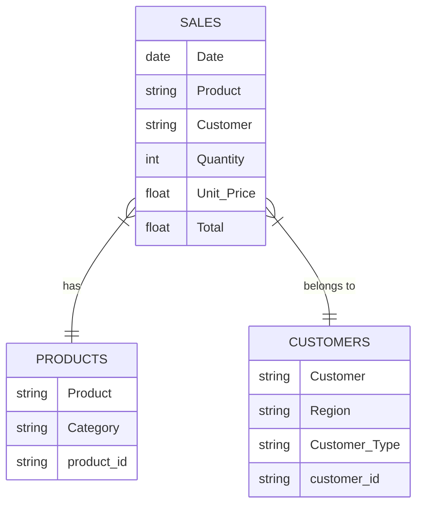
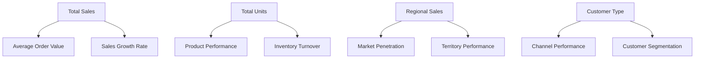

# Pharmaceutical Sales Dashboard

A Streamlit-based interactive dashboard for analyzing pharmaceutical sales data, providing insights into sales trends, product performance, and regional distribution.

## Features

- 📊 Interactive visualizations
- 📈 Real-time data filtering
- 📱 Responsive design
- 🔍 Detailed sales analytics
- 📉 Trend analysis
- 🌍 Regional performance tracking

## Dashboard Views

### Main Dashboard Overview


The main dashboard shows key metrics and trends:
- Total Sales: $2,083,417.33
- Total Units Sold: 37,809
- Average Order Value: $2,854.00
- Total Orders: 730
- Daily sales trend visualization
- Regional distribution pie chart

### Product Performance Analysis


The product analysis dashboard provides:
- Product-wise sales breakdown
- Category performance metrics
- Top performing products (led by Amoxicillin)
- Interactive filtering by region and category

## Project Structure

```
pharma-sales-dashboard/
├── data/                    # Sample data files
│   ├── sales.csv           # Sales transaction data
│   ├── products.csv        # Product information
│   └── customers.csv       # Customer information
├── pharma_dashboard/       # Main application package
│   ├── dashboard.py        # Streamlit dashboard implementation
│   └── data_processor.py   # Data processing and validation
├── tests/                  # Unit tests
├── docs/                   # Documentation
├── requirements.txt        # Python dependencies
├── setup.py               # Package installation script
├── LICENSE                # MIT License
└── README.md              # Project documentation
```

## Data Requirements

### sales.csv
- Date: Date of sale (YYYY-MM-DD)
- Product: Product name
- Customer: Customer ID
- Quantity: Number of units sold
- Unit Price: Price per unit
- Total: Total sale amount

### products.csv
- Product: Product name
- Category: Product category
- product_id: Unique product identifier

### customers.csv
- Customer: Customer ID
- Region: Customer region
- Customer Type: Type of customer (Hospital/Clinic/Pharmacy)
- customer_id: Unique customer identifier

## Installation

1. Clone the repository:
```bash
git clone https://github.com/yourusername/pharma-sales-dashboard.git
cd pharma-sales-dashboard
```

2. Create and activate a virtual environment:
```bash
python -m venv .venv
source .venv/bin/activate  # On Windows: .venv\Scripts\activate
```

3. Install dependencies:
```bash
pip install -r requirements.txt
```

4. Run the dashboard:
```bash
streamlit run pharma_dashboard/dashboard.py
```

## Usage

1. Access the dashboard at `http://localhost:8501`
2. Use the sidebar filters to:
   - Select date range
   - Filter by region
   - Filter by product category
   - Set sales amount range
3. View the interactive visualizations:
   - Daily sales trend
   - Product performance
   - Regional distribution
   - Category performance

## Development

### Running Tests
```bash
python -m pytest tests/
```

### Code Style
This project follows PEP 8 style guidelines. Use the following tools:
```bash
# Install development dependencies
pip install -r requirements-dev.txt

# Run linting
flake8 pharma_dashboard/

# Run type checking
mypy pharma_dashboard/
```

## Contributing

1. Fork the repository
2. Create a feature branch (`git checkout -b feature/amazing-feature`)
3. Commit your changes (`git commit -m 'Add some amazing feature'`)
4. Push to the branch (`git push origin feature/amazing-feature`)
5. Open a Pull Request

## License

This project is licensed under the MIT License - see the [LICENSE](LICENSE) file for details.

## Acknowledgments

- [Streamlit](https://streamlit.io/) for the dashboard framework
- [Plotly](https://plotly.com/) for interactive visualizations
- [Pandas](https://pandas.pydata.org/) for data manipulation

## Contact
For questions or suggestions, please contact the BI team.

## Data Schema and KPI Relationships

### Data Schema


### KPI Relationships


## Business Logic

### Core Metrics Calculation
- Total Sales = SUM(Quantity × Unit_Price)
- Average Order Value = Total Sales ÷ Number of Orders
- Sales Growth Rate = ((Current Period Sales - Previous Period Sales) ÷ Previous Period Sales) × 100
- Market Penetration = (Active Customers in Region ÷ Total Potential Customers in Region) × 100
- Product Performance Score = (Units Sold × Profit Margin) + (Customer Satisfaction × 0.3)

### Data Processing Rules
1. Date Validation
   - Exclude records with null dates
   - Format dates to YYYY-MM-DD
   - Filter out future dates

2. Sales Validation
   - Total amount must equal Quantity × Unit_Price
   - Negative quantities are invalid
   - Zero-price transactions require management approval

3. Regional Analysis
   - Group sales by Region and Customer Type
   - Calculate market share per region
   - Track year-over-year growth by territory

4. Product Categories
   - Group products by therapeutic area
   - Track seasonal variations
   - Monitor stock levels and reorder points 