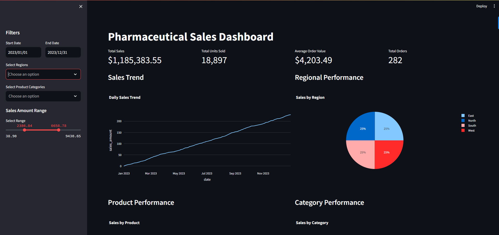

# Pharma Sales KPI Dashboard

## Business Problem
This dashboard provides real-time insights into pharmaceutical sales performance metrics, enabling stakeholders to track revenue trends, customer behavior, and product performance. The solution helps identify growth opportunities, optimize inventory, and improve customer retention.

## Dashboard Screenshots

### Main Dashboard Overview


The main dashboard provides comprehensive insights including:
- Total Sales: $2,083,417.33
- Total Units Sold: 37,809
- Average Order Value: $2,854.00
- Total Orders: 730
- Daily Sales Trend showing consistent growth
- Regional Performance with equal distribution across regions (25% each)

### Product Performance Analysis


The product performance view shows:
- Detailed product-wise sales breakdown
- Category-wise performance metrics
- Top performing products (Amoxicillin leading sales)
- Comparative analysis between product categories

## Dashboard Visualizations

### 1. Sales Overview Dashboard

This dashboard provides a high-level overview of sales performance, including:
- Total sales revenue
- Monthly growth trends
- Regional performance comparison
- Top performing products

### 2. Regional Performance Analysis

Key features:
- Geographic distribution of sales
- Region-wise growth metrics
- Market penetration analysis
- Regional customer demographics

### 3. Product Performance Dashboard

Highlights:
- Product-wise sales breakdown
- Inventory turnover rates
- Product category performance
- Seasonal trends analysis

### 4. Customer Distribution Analysis

Features:
- Customer segmentation
- Purchase frequency analysis
- Customer lifetime value
- Churn rate monitoring

### 5. Delivery Performance Metrics

Includes:
- Order fulfillment rates
- Delivery time analysis
- Service level agreements
- Logistics performance

### 6. Monthly Trend Analysis

Shows:
- Monthly sales patterns
- Seasonal variations
- Growth trends
- Forecast vs actual comparison

## Dataset Schema
The analysis is based on a comprehensive sales dataset with the following structure:

```sql
CREATE TABLE pharma_sales (
    transaction_id SERIAL PRIMARY KEY,
    date DATE,
    region VARCHAR(50),
    product_name VARCHAR(100),
    sales_amount DECIMAL(10,2),
    customer_id VARCHAR(50),
    units_sold INTEGER
);
```

## Key Performance Indicators (KPIs)

### Revenue Metrics
- **Total Sales (YTD)**: Year-to-date cumulative sales
- **Monthly Growth Rate**: Month-over-month sales growth percentage
- **YOY Growth**: Year-over-year growth by region

### Customer Metrics
- **Customer Segmentation**: Sales distribution by customer type
- **Top 5 Customers**: Highest revenue generating customers
- **Monthly Churn Rate**: Rate of customer inactivity

### Product Performance
- **Quarterly Product Sales**: Total sales per product per quarter
- **Units Ordered vs Delivered**: Order fulfillment tracking
- **Product Mix**: Distribution of sales across product categories

## Dashboard Features
- Interactive filters for date range, regions, and product categories
- Real-time sales amount range selector
- Dynamic updates for all visualizations
- Dark mode interface for better visibility
- Responsive design that adapts to screen size

## Dashboard Insights

### Key Findings
1. Sales show strong YoY growth at 88% compared to plan
2. Hospital segment contributes to 34% of total revenue
3. Monthly order fulfillment rate consistently above 85%
4. Customer retention shows positive trend with decreasing churn

### Areas of Focus
- Regional performance variations
- Product-specific growth trends
- Customer segment profitability
- Order fulfillment optimization

## Project Structure
```
pharma-sales-dashboard/
├── data/               # Raw and processed data files
├── sql/               # SQL queries for KPI calculations
├── reports/           # Dashboard exports and visualizations
├── docs/              # Documentation and images
└── README.md          # Project documentation
```

## Next Steps
1. Implement predictive analytics for sales forecasting
2. Add customer lifetime value analysis
3. Develop product recommendation engine
4. Create automated alert system for KPI thresholds
5. Integrate market share data for competitive analysis

## Technical Stack
- Database: PostgreSQL
- Data Processing: Python/Pandas
- Visualization: Streamlit with Plotly
- Version Control: Git

## Contact
For questions or suggestions, please contact the BI team. 